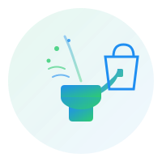

# 🎨 ShopifyGenie OMS - Brand Identity Guide

<div align="center">
  
</div>

## Brand Overview

**ShopifyGenie OMS** represents the perfect blend of **magic** (the genie fulfilling merchant wishes) and **commerce** (Shopify's e-commerce platform). Our brand identity reflects efficiency, innovation, and seamless integration.

### Tagline
> **"Smarter Orders. Seamless Fulfillment."**

This encapsulates our core value proposition: intelligent order management that works effortlessly.

---

## 🎨 Color Palette

### Primary Colors

#### Genie Blue `#1F8EF1`
- **Usage**: Primary buttons, links, highlights
- **Meaning**: Trust, technology, clarity
- **RGB**: `31, 142, 241`
- **Tailwind**: `primary-500`, `genie-blue`

#### Emerald Green `#2ECC71`
- **Usage**: Success states, fulfillment indicators, accents
- **Meaning**: Growth, completion, success
- **RGB**: `46, 204, 113`
- **Tailwind**: `emerald-500`, `genie-emerald`

### Supporting Colors

```css
/* Light Shades */
--genie-light: #F0F9FF;  /* Backgrounds, cards */
--genie-dark: #0c4a6e;   /* Text, dark mode */

/* Gradient */
--gradient-genie: linear-gradient(135deg, #1F8EF1 0%, #2ECC71 100%);
```

### Semantic Colors
- **Success**: `#2ECC71` (Emerald)
- **Warning**: `#F39C12` (Orange)
- **Error**: `#E74C3C` (Red)
- **Info**: `#1F8EF1` (Blue)

---

## 🔤 Typography

### Font Stack
```css
font-family: 'Inter', 'Segoe UI', -apple-system, BlinkMacSystemFont, sans-serif;
```

### Font Weights
- **Regular**: 400 - Body text
- **Medium**: 500 - Subheadings
- **Semibold**: 600 - Headings
- **Bold**: 700 - Logo, major headings
- **Extrabold**: 800 - Hero text

### Font Sizes
- **XS**: 0.75rem (12px) - Captions, labels
- **SM**: 0.875rem (14px) - Body small
- **Base**: 1rem (16px) - Body text
- **LG**: 1.125rem (18px) - Subheadings
- **XL**: 1.25rem (20px) - Card titles
- **2XL**: 1.5rem (24px) - Section headings
- **3XL**: 1.875rem (30px) - Page titles

---

## 🖼️ Logo Usage

### Primary Logo


**File**: `client/public/logo.svg`

**Components**:
1. **Magic Lamp** - Represents the "Genie" concept
   - Gradient fill (blue → emerald)
   - Animated glow effect
   
2. **Shopping Bag** - Shopify commerce integration
   - Blue outline
   - Minimalist design
   
3. **Data Flow Lines** - Synchronization
   - Animated sparkles
   - Flowing curves

### Logo Specifications

#### Size Guidelines
- **Minimum Size**: 32px × 32px (favicon)
- **Small**: 64px × 64px (mobile header)
- **Medium**: 128px × 128px (desktop header, cards)
- **Large**: 200px × 200px (login screen, splash)
- **Extra Large**: 400px × 400px (marketing materials)

#### Clear Space
Maintain a minimum clear space of **20px** around the logo on all sides.

#### Logo Variants

1. **Full Color** (default)
   - Use on light backgrounds
   - Gradient colors: #1F8EF1 → #2ECC71

2. **White/Light**
   - Use on dark backgrounds
   - Single color: #FFFFFF with 90% opacity

3. **Monochrome**
   - Use when color isn't available
   - Single color: #0c4a6e

### Incorrect Usage ❌

- Don't stretch or distort the logo
- Don't change colors outside brand palette
- Don't add drop shadows or effects (except built-in animation)
- Don't place on busy backgrounds
- Don't rotate or skew

---

## 🎯 Favicon

### Favicon.svg


**File**: `client/public/favicon.svg`

Simplified version of the main logo:
- Magic lamp only
- Minimal detail for small sizes
- Maintains brand colors
- Includes sparkle animation

### Generating favicon.ico

The project includes `favicon.svg`. To generate `favicon.ico`:

**Option 1: Online Tool**
1. Visit https://realfavicongenerator.net/
2. Upload `client/public/favicon.svg`
3. Download generated `favicon.ico`
4. Place in `client/public/favicon.ico`

**Option 2: Using ImageMagick**
```bash
convert -background none \
        -define icon:auto-resize=16,32,48 \
        client/public/favicon.svg \
        client/public/favicon.ico
```

---

## 🎭 UI Components

### Buttons

#### Primary Button
```vue
<button class="bg-gradient-genie text-white px-6 py-2 rounded-lg 
               hover:shadow-lg transition-all duration-300">
  Action
</button>
```

#### Secondary Button
```vue
<button class="border-2 border-genie-blue text-genie-blue px-6 py-2 rounded-lg 
               hover:bg-genie-blue hover:text-white transition-all">
  Action
</button>
```

### Cards
```vue
<div class="bg-white rounded-xl shadow-lg p-6 
            hover:shadow-xl transition-shadow duration-300">
  <!-- Content -->
</div>
```

### Gradients

#### Background Gradient
```css
background: linear-gradient(135deg, #1F8EF1 0%, #2ECC71 100%);
```

#### Text Gradient
```css
background: linear-gradient(135deg, #1F8EF1 0%, #2ECC71 100%);
-webkit-background-clip: text;
-webkit-text-fill-color: transparent;
```

---

## ✨ Animations

### Pulse (Logo on Login)
```css
@keyframes pulse {
  0%, 100% { opacity: 1; }
  50% { opacity: 0.7; }
}

animation: pulse 3s cubic-bezier(0.4, 0, 0.6, 1) infinite;
```

### Shimmer (Loading States)
```css
@keyframes shimmer {
  0% { background-position: -1000px 0; }
  100% { background-position: 1000px 0; }
}

animation: shimmer 2s linear infinite;
```

### Slide In (Transitions)
```css
@keyframes slideIn {
  0% { 
    transform: translateX(-100%);
    opacity: 0;
  }
  100% { 
    transform: translateX(0);
    opacity: 1;
  }
}
```

---

## 📱 Responsive Design

### Breakpoints
```css
/* Mobile First */
sm: 640px   /* Small tablets */
md: 768px   /* Tablets */
lg: 1024px  /* Laptops */
xl: 1280px  /* Desktops */
2xl: 1536px /* Large displays */
```

### Logo Sizing
- **Mobile**: 40px × 40px (header)
- **Tablet**: 64px × 64px
- **Desktop**: 80px × 80px
- **Login Screen**: 128px × 128px

---

## 🌓 Dark Mode

### Dark Mode Colors
```css
/* Background */
--dark-bg: #0f172a;
--dark-card: #1e293b;

/* Text */
--dark-text: #e2e8f0;
--dark-text-secondary: #94a3b8;

/* Accent (keep brand colors) */
--dark-accent-blue: #1F8EF1;
--dark-accent-emerald: #2ECC71;
```

### Logo in Dark Mode
Use the light variant with white/light emerald colors.

---

## 📄 Marketing Materials

### Social Media
- **Profile Picture**: Full logo, 400px × 400px
- **Cover Image**: Logo + tagline, 1500px × 500px
- **Post Images**: Gradient background with logo overlay

### Email Signatures
```html

<p style="color: #1F8EF1; font-weight: 600;">ShopifyGenie OMS</p>
<p style="color: #64748B; font-size: 0.875rem;">Smarter Orders. Seamless Fulfillment.</p>
```

---

## 🎬 Brand Voice

### Tone
- **Professional** yet approachable
- **Confident** but not arrogant
- **Helpful** and solution-oriented
- **Modern** and tech-savvy

### Writing Style
- Use active voice
- Keep sentences concise
- Focus on benefits, not just features
- Use "we" and "you" for connection

### Example Headlines
✅ "Your orders, organized and optimized"  
✅ "Fulfill faster. Deliver better."  
✅ "One platform. Unlimited possibilities."  

❌ "Revolutionary order management system"  
❌ "The most advanced OMS available"  

---

## 📚 Assets Checklist

### Required Files
- [x] `client/public/logo.svg` - Main logo
- [x] `client/public/favicon.svg` - Favicon SVG
- [ ] `client/public/favicon.ico` - Favicon ICO (needs generation)
- [x] `client/src/assets/logo-text.svg` - Logo with text
- [x] Brand colors in `tailwind.config.js`
- [x] Animations and keyframes configured

### Future Assets
- [ ] Social media banners
- [ ] Email templates
- [ ] Presentation deck
- [ ] Stickers/swag designs
- [ ] Video intro animation

---

## 🔗 Quick Links

- **Logo Files**: `client/public/`
- **Tailwind Config**: `client/tailwind.config.js`
- **Login Screen**: `client/src/views/LoginView.vue`
- **Dashboard Header**: `client/src/layouts/DashboardLayout.vue`
- **Main HTML**: `client/index.html`

---

<div align="center">
  <p><strong>ShopifyGenie OMS</strong></p>
  <p>✨ Smarter Orders. Seamless Fulfillment. ✨</p>
</div>

